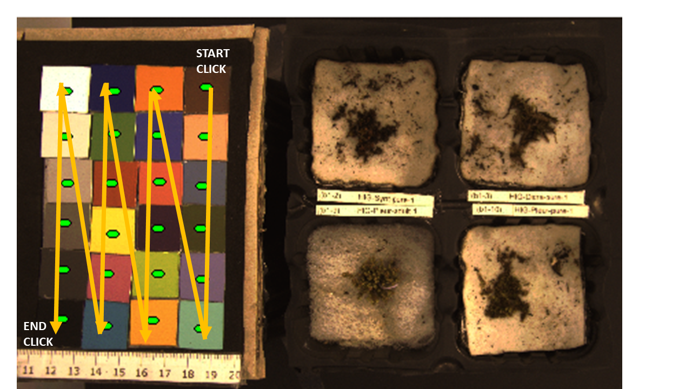

PhotomossR workflow
================

Author: Manuel Molina-Bustamante
---
Date: 24/7/2020
---

## What is *PhotomossR*? 
***PhotomossR*** is a developement from **mosscoder/crustcover** package
(https://github.com/mosscoder/crustCover). ***PhotomossR*** is the analitical part of the Photomoss protocol, an open source focused on meassure of Biological Soil Covers areas in field or lab experiments. To achieve this duty, it uses the
same principles as (Fischer2012) that take advantage of Near InfraRed
(NIR) and visible RGB images. With the color channels of this images, we can
calculate several spectral indexes. In contrast with *crustcover* that measures
seven index, *PhotomossR* can use a great set of 19 spectral indexes. As
*crust cover*, *PhotomossR* core function can calculate moss area using a
given spectral index and implementigg a custom threshold value, but in
addition, it can apply an authomatic segmentation following a set of 12
different segmentation methods if needed. Other additional
functionalities of *PhotomossR* in comparison with *crustcover* are the
semiautomatisation of annalysis over the images, and a segmentation
accuracy test functionality, to test the segmentation accuracy comparing
the calculated surfaces with a the baseline prvidedby a binary mask done with ImageJ.

## Installing PhotomossR

We need to install *devtools* package:

    if(require(devtools)!=T){
      install.packages('devtools')
      require(devtools)
    }

Then we install *PhotomossR* from GitHub branch:

    install_github("MMolBUs/PhotomossR")
    library(PhotomossR)

Maybe you need to install some other packages, so be aware of warnings
and install them.

## Set working directory structure

This is an important step, because the function searches the images in a
directory structure that has to be always the same.

Our working directory have to include the following folders and files:

-   ***vis*** folder: this folder includes the RGB images.

-   ***nir*** folder: this folder includes the NIR images.

-   ***mask*** folder: this folder includes the binary mask images.
    Mandatory if in the function *ccspectral.df* the argument
    *manual.mask.test = T*.

-   ***rois*** folder: this folder includes the *regions of interest*
    (***rois***)for each pair of nir and vis images (or for each triad
    of nir, vis, mask if it is the case). A *roi* is the region of the
    image where we can find the moss sample to analyze. It is necesary
    to previously create this files using *ImageJ*.

    -   **Attention.1**: if the nir and vis images contain several
        samples the ***rois*** folder must include as many subfolders
        samples. In each subfolder we must put the .roi files for that
        nir-vis image. So, if an image includes four samples, as in
        Figure 1, and we want to analyze them all, we need to have four
        rois. in that subfolder.

    -   **Attention.2**: the .roi files in each subfolder must be
        ordered in the same way as the *names.csv* file (we will talk
        about it later.)

## Set working directory

    wd #your working directory
    setwd (wd)
    wd.path <- getwd()

## Start with the functions

### *chart.2*

We create the chart object (a list of polygons) with the
*chart.2* function. To do this we click over the color cells
chart in the image. Important note: folow the order as indicated in the
figure.

    chart <- chart.2(wd.path) 

{width="5.83333in" height="3.28125in"}

Figure 1

### *roi2polygon.2* and *extractPIX.from.Poly*.

Now we use the *roi2polygon.2* function to create a readable polygon
files from the ImageJ .roi files. Then we crop the
pixels that fell inside the polygons and obtain a list ploygon
data.frame (*obs.areas* object)

   roi_paths <- list.files(path = "./rois",pattern=".roi$",full.names = T, recursive = T)

   obs.areas <- roi2polygon(roi.folder = "./rois", pic.folder ="./vis")

### *ccspectral.df*

This is the core function of PhotomossR.

The basic result of this function is a dataframe with the **areas in
number of pixels** of background and moss area for each sample. If
argument *descrip = T* the descriptive statistics of the different
areas.

#### Arguments in *ccspectral.df*:

-   _**wd.path**: the path of the working directory where are the
    _vis_, _nir_, _mask_, _rois_ folders and _names.csv_ file.

-   _**chart**_: polygon list obtained with *chart.2* function.

-   _**pic.format**_: Picture file format. It could be "jpg" for .jpg, 
    .JPG and .jpeg; or "tif", for .tif format. Default = "tif".

-   _**obs.areas**_: list of polygons data.frame obtained with 
    *roi2polygon* function.

-   _**pdf**_: logical, to present the results in image and histogram 
    of moss areas. Default = F.

-   _**calculate.thresh**_: logical, to Calculate autothreshold. 
    Default = F.

-   _**descrip**_: logical, to calculate statistical descriptors of index
    value in the classified areas. Default = F.

-   _**manual.mask.test**_: logical, if you want to test the accuracy of
    image segmentation comparing with handmade drawn moss area. Default
    = F.

-   _**index.**_: character with what index you want to calculate. By
    default, all options: *index.* = c("NDVI", "SR", "MSAVI", "EVI",
    "CI", "BSCI", "BI","NORR", "NORG", "NORB", "EXR", "EXG","EXB",
    "EXGR", "CIVE", "VEG", "HUE", "SAT", "VAL") Index are more detailed bellow.

-   _**threshold.method**_: character, if *calculate.thresh= T.* The
    autosegmentation method to separate moss from background. The
    argument can be ONE of the following values: "Huang", "IJDefault",
    "IsoData", "Li", "Mean", "MinErrorI", "Moments", "Otsu",
    "Percentile", "RenyiEntropy", "Shanbhag", "Triangle". Autothereshold methods are more detailed bellow.

-   _**threshold.vector**_: numeric, if *calculate.thresh= F* the index
    value to segment the image to separate moss from background. Must
    have the same length than *index.* argument, and must respect
    *index.* argument default order.

-   _**descriptors.**_: character, if *descrip= T* the statistic
    descriptors of index values in the classified areas. Default:
    *descriptors.* = c("median","mean","sd","min", "max","diff.range")

##### _*index*_ argument options:

  1. _**NDVI**_: Normalized Differential Vegetation Index. Is the
        normalize difference beween Near Infrared (NIR) values and
        visible RED values. NDVI is used in teledetection aplications to
        measure physiological active vegetation, because clorophyl
        absorbs Red and reflects NIR. NDVI scales between -1 and 1,
        being 1 the value of an active green leaf.
        $$NDVI = \frac{(NIR - RED)}{(NIR + RED)}$$

  2. _**SR**_: Simple Ratio. Te difference between NIR value and Red
        value, without standarisation. It's an uscaled index
        $$SR = NIR - RED$$

  3. _**MSAVI**_: Second Modified Soil Adjusted Vegetation Index. Use
        a self-adjusting soil factor to reduce background soil
        influence. MSAVI scales between -1 and 1 (Qi1994).
        $$MSAVI = \frac{2\times NIR + 1 - \sqrt{(2 x NIR + 1)2 - 8 \times (NIR -RED)}}{2}$$

  4. _**EVI**_: Enhanced Vegetation Index. Is an enhanced NDVI that
        includes a soil adjustment factor and uses the blue band to
        correct the red band atmospheric aerosol distortion.(Liu1995),
        (Huete1999)
        $$EVI = \frac{2.5 x ((NIR - RED) }{(NIR + 6 \times RED - 7.5 \times BLUE + 1))}$$

  5. _**CI**_: Crust Index. Is based on the standarized difference
        between RED and BLUE bands. It's an index develloped to detect
        Biological Solil Crust with cyaniobacteria. (Karnielli, 1997)
        $$CI = 1 - \frac{RED - BLUE}{RED + BLUE}$$

  6. _**BSCI**_: Biological Soil Crust Index. Is based on GREEN, RED
        and NIR bands. This index was designed to exacerbate the
        spectral differences between Biological Soil Crusts and bares
        sand, dry plants and green plants. Include an adjustment factor
        with value 2 to magnify the absolute difference between RED and
        GREEN bands (Chen2005)
        $$BSCI = \frac{(1 - 2 \times |RED - GREEN|)}{mean(GREEN, RED, NIR)}$$

  7. _**BI**_: Brightness Index**. (Escadafal and Bacha 1996)
        $$BI = \sqrt{GREEN^m2 + RED^2 + NIR^2}$$

  8. _**NORR**_: Normalized Red.
        $$NORR = \frac{\frac{RED}{RED_max}}{\frac{RED}{RED_max}+\frac{GREEN}{GREEN_max}+
                  \frac{BLUE}{BLUE_max}}$$

  9. _**NORG**_: Normalized Green.
        $$\frac{\frac{GREEN}{GREEN_max}}{\frac{RED}{RED_max}+\frac{GREEN}{GREEN_max}+
                  \frac{BLUE}{BLUE_max}}$$

  10. _**NORB**_: Normalized Blue.
        $$\frac{\frac{BLUE}{BLUE_max}}{\frac{RED}{RED_max}+\frac{GREEN}{GREEN_max}+
                  \frac{BLUE}{BLUE_max}}$$

  11. _**EXR**_: Excess Red. $$EXR = 1.4 \times NORR - NORG$$

  12. _**EXG**_: Excess Green. $$EXG = 2 \times NORG - NORR - NORB$$

  13. _**EXB**_: Excess Blue. $$EXB = 1.4 \times NORB - NORG$$

  14. _**EXGR**_: Excess Green minus Excess Red. $$EXGR = EXG - EXR$$

  15. _**CIVE**_: Color index of vegetation extraction.
        $$CIVE = 0.441 \times NORR - 0.81 l \times NORG + 0.385 \times NORB + 18.78745$$

  16. _**VEG**_: Vegetative. a = 0.667 (Hage et al 2006)
        $$VEG = \frac{NORG}{NORR^a \times NORB^{1-a}}$$

  17. _**HUE**_: Dominant colour wavelength level. Based on a HSV colour space HUE, or tint, refers is the analogue of dominant wavelength (Hall, 1989; Philipp & Rath, 2002). 

  18. _**SAT**_: Saturation level in the HSV colour space, define how “pure” the colour is (Hall, 1989; Philipp & Rath, 2002)

  19. _**VAL**_: Value , or brightness, level in the HSV colour space (Hall, 1989; Philipp & Rath, 2002). 

##### _*threshold.method*_ argument options are:
  
  1. _**Huang**_: a fuzzy set-based method that segmentize the image in meaningful regions by minimizing the grey level entropy (Huang & Wuang 1995).
  
  2. _**IsoData**_: An iterative method to automatically find a threshold. The iterations provide a cleaner extraction of the object region in each round (Ridler & Calvard, 1978).
  
  3. _**IJDefault**_: ImageJ default option is an adaptation of the same IsoData method but ignores maximum and minimum values. (ref: https://imagej.net/Auto_Threshold).
  
  4. _**Li**_: Iterative Minimum Cross Entropy Thresholding, selects a threshold that minimizes the cross entropy of the image and its segmented version. It assumes that the two segmented parts of the image have normal distributions (Li & Tam, 1998)
  
  5. _**Mean**_: This method uses the mean value of the image to set the threshold (Glasbey, 1993).
  
  6. _**MinErrorI**_: uses an iterative algorithm to find a good segmentation threshold by a repeated application of the Bayes minimum error rule over the grey levels of the resulting image regions (Kittler & Illingworth, 1986).
  
  7. _**Moments**_: Moment-Preserving Thresholding, by the assignation of a representative pixel value for the two image regions, but without changing the first three moments between the original image and the segmented one (Tsai, 1985).
  
  8. _**Otsu**_: select a threshold automatically in a gray level histogram from a discriminant analysis viewpoint. The optimal is selected by a discriminant criterion that maximizes the separability the resultant gray level classes. (Otsu, 1979).
  
  9. _**Percentile**_: Assumes that the background pixels are the 50% of all pixels (Doyle, 1962).
  
  10. _**RenyiEntropy**_: Use image entropy to choose a threshold from the gray-level histogram of a picture. The algorithm chooses a threshold that maximize the information between the object and the background. (Kapur, Sahoo, PK & Wong, 1985).
  
  11. _**Shanbhag**_: development of the *RenyiEntropy* method, uses information based on the uncertainty of a pixel to be assigned to an object area o to the background, using the proximity to the extreme grey levels and the frequency of grey level in each group corresponding to be in (Shanbhag, 1994).
  
  12. _**Triangle**_: Use homogeneous grey color contours to divide the image in grey levels and set a hierarchical relationship between them as in (Zack, Rogers, Latt, 1977).

#### Example:

    ccspectral.df(tif.path,
                  chart,
                  obs.areas,
                  pdf = F,
                  calculate.thresh = T,
                  descrip = T,
                  manual.mask.test = F,
                  index. = c("NDVI", "SR"),
                  threshold.method = c("Huang"),
                  threshold.vector = NULL,
                  descriptors. = 
                    c("median","mean","sd","min",
                      "max","diff.range" )
                  )

Where:
* *tif.path* = your working directory
* *chart*= object **chart** obtained wuith teh function *chart.from.tif*
* *obs.areas*= Polygon files obtained with *roi2polygon.2* function

The resulting data.frame is saved in a new folder in your working
directory.
